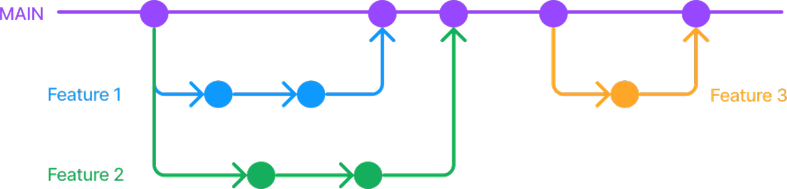

# 📸 Kamera

<div align="center">
  
  <p>Pre-Yous</p>
<p>pre- 는 영어 접두사로, 시간적으로 "이전의", "미리", "앞에"라는 의미를 가집니다.<Br>
Pre-Yous는 사진을 촬영하기에 앞서 오버레이 스케치로 촬영 구도를 도와주는 카메라 앱입니다.</p>

</div>

<br />
저희는 일상 속에서 사람들이 어떤 상황에서 불편함을 느끼는지 관찰하며, 실질적인 문제를 해결하고자 이 프로젝트를 시작했습니다. 많은 사람들이 원하는 사진을 찍기 위한 애로사항이 있다는 점을 관찰하게되었습니다. 저희 또한 마찬가지였습니다.이러한 문제를 해결하기 위해, 저희는 사용자가 원하는 사진을 보다 손쉽고 정확하게 촬영할 수 있도록 가이드 레이아웃을 제공하는 앱을 기획하게 되었습니다.

<br>
<br>
<br>

# 🔗 링크

<div align="center">

[앱스토어](https://apps.apple.com/kr/app/pre-yous/id6747673290) | [github 레포지토리](https://github.com/kamera-project/kamera)

</div>
<br>
<br>
<br>

# 📖 목차

- [📸 Kamera](#📸-kamera)
- [🔗 링크](#🔗-링크)
- [✨ 핵심 기능](#✨-핵심-기능)
  - [🖼️ “이렇게 찍어줘” 실시간 스케치 가이드 오버레이](#🖼️-이렇게-찍어줘-실시간-스케치-가이드-오버레이)
  - [🎯 “이렇게 촬영할게” 스티커 인터랙션](#🎯-이렇게-촬영할게-스티커-인터랙션)
- [🧰 기술 스택 / 구조](#🧰-기술-스택--구조)
- [⚙️ 기능 구현 및 챌린지](#⚙️-기능-구현-및-챌린지)
  - [📷 카메라와 앨범 접근 허용과 iOS 앱 심사 탈락](#📷-카메라와-앨범-접근-허용과-ios-앱-심사-탈락)
  - [📂 난 카메라 촬영만 요청했는데 내 동의 없이 저장을](#📂-난-카메라-촬영만-요청했는데-내-동의-없이-저장을)
  - [🧠 스케치 윤곽선 검출 : John F Canny](#🧠-스케치-윤곽선-검출--john-f-canny)
  - [📐 스티커와 피타고라스](#📐-스티커와-피타고라스)
- [📝 회고](#📝-회고)
  - [🔀 깃 브랜치 전략](#🔀-깃-브랜치-전략)
  - [🤝 협업 시 신경 썼던 부분](#🤝-협업-시-신경썼던-부분)
  - [👥 개인 별 회고](#👥-개인-별-회고)
  - [💡 이 프로젝트를 통해 얻은 인사이트](#💡-이-프로젝트를-통해-얻은-인사이트)
  - [🌟 좋았던 점](#🌟-좋았던-점)
  - [😅 아쉬웠던 점](#😅-아쉬웠던-점)
  - [🔧 보완하고 싶은 점](#🔧-보완하고-싶은-점)

<br />
<br />
<br />

# ✨ 핵심 기능

가족, 친구, 연인의 요청으로 사진을 촬영한 후, 만족스럽지 않은 결과물로 곤란한 상황이 종종 있습니다.
“**이렇게 찍어라**” 라는 요청을 잘 실행할 수 있도록
**스케치 가이드**와 **스티커**를 통해 사진 촬영 전 함께 확인하고 촬영할 수 있는 기능을 구현하고자 했습니다.

> ### **🖼️ “이렇게 찍어줘” 실시간 스케치 가이드 오버레이**

- 촬영 구도를 가이드로 만들기 위해 **사용자**는 사진을 촬영합니다.
- 카메라앱이 영상, 이미지 처리 오픈 소스 라이브러리인 **OpenCV의 Canny 알고리즘**을 통해 촬영한 사진으로부터 윤곽선을 검출하고,
- 검출한 윤곽선을 가이드 오버레이로 만들고 프리뷰 위에 표현합니다.

<table>
  <tr>
    <td></td>
    <td></td>
  </tr>
</table>
<br />
<br />

> ### **“🎯 “이렇게 촬영할게” 스티커 인터랙션**

- **사용자**는 패널에서 스티커 선택하고 위치를 이동시킬 수 있고,
- 두 손가락 제스처로 스티커 크기를 조절합니다.
- 배치한 스티커는 투명도를 조절해가며 촬영할 대상을 위치시킬 가이드로 사용합니다.

<table>
  <tr>
    <td></td>
    <td></td>
  </tr>
</table>
<br />
<br />
<br />
<br />

# 🧰 기술 스택 / 구조

> ### **핵심 기술**

<div>
  
  
</div>
<Br>

> ### **상태 관리 도구**

<div>
  
</div>
<Br>

> ### **테스트**

<div>
  
</div>
<Br>

> ### **배포**

<div>
  
</div>
<Br>

> ### **협업**

<div>
  
  
  
</div>
<br />
<br />
<br />
<br />
<br />

# ⚙️ 기능 구현 및 챌린지

<br />
<br />

> ## 📷 카메라와 앨범 접근 허용과 iOS 앱 심사 탈락

처음 카메라 앱을 만들 때, 사용자 개인의 데이터(카메라, 앨범 등)에 접근하려면 어떤 방식으로 허가를 받아야 하는지 고민하고 Info.plist 파일에 다음과 같은 설명을 추가했습니다:

```javascript
<key>NSCameraUsageDescription</key>
<string>앱에서 사진 촬영을 위해 카메라 접근 권한이 필요합니다.</string>
<key>NSPhotoLibraryAddUsageDescription</key>
<string>갤러리에 사진을 저장하기 위해 접근이 필요합니다.</string>
<key>NSPhotoLibraryUsageDescription</key>
<string>갤러리에 사진을 불러오기 위해 접근이 필요합니다.</string>
```

앱 등록 심사를 신청했지만 Apple 앱 심사에 통과하지 못했고, 그 이유는 다음과 같았습니다.

<div>
  
</div>

요약하면, "사용될 데이터에 대한 설명이 출분하지 않다", "명확하고 완전하게 설명해야해하고 어떻게 사용할 것인지에 대한 구체적인 예시를 제시해라” 는 내용이었습니다.

[Apple의 공식 문서](https://developer.apple.com/videos/play/tech-talks/110152/)와 다른 [사례](https://developer.apple.com/forums/thread/113646)들을 찾아보면서 사용자에게 권한 요청을 하는 방식에 대해 살펴봤습니다. iOS 앱 정책상 카메라와 앨범 접근 권한은 반드시 명시적이고 투명한 설명을 동반해야 했습니다. 팀원과 함께 다음과 같이 문구를 수정하였습니다.

```javascript
	<key>NSCameraUsageDescription</key>
	<string>앱에서 사진 촬영 및 필터 적용을 위해 카메라 접근이 필요합니다. 촬영한 사진은 편집 후 갤러리에 저장하거나 공유할 수 있습니다.</string>
	<key>NSPhotoLibraryAddUsageDescription</key>
	<string>사진을 갤러리에 저장하기 위해 접근이 필요합니다. 저장된 사진은 언제든지 다시 불러와 추가 편집 및 삭제가 가능합니다.</string>
	<key>NSPhotoLibraryUsageDescription</key>
	<string>갤러리의 사진을 불러와 삭제 및 편집을 하기 위해 접근이 필요합니다. 선택한 사진만 앱에서 사용됩니다.</string>
```

<Br>
결과적으로 심사에 통과해 앱을 배포할 수 있었고, 스마트폰을 사용하며 무심코 눌렀던 ‘권한 허용’ 버튼 뒤에 어떤 준비와 절차가 필요한지 알게 되었습니다. 이 경험을 통해 사용자의 입장에서 납득 가능한 설명이 왜 중요한지, 그리고 iOS에서 이를 왜 중요하게 요구하는지 이해할 수 있었습니다. 기능 구현만큼이나 **신뢰를 주는 문구와 표현이 개발자의 중요한 역할**이라는 점도 다시 한번 느꼈습니다.

<br />
<br />
<br />

> ## 📂 난 카메라 촬영만 요청했는데, 내 동의 없이 저장을..?

촬영 기능을 위한 라이브러리를 선택하는 과정에서 'react-native-camera' 그리고 'react-native-vision-camera'를 놓고 비교했습니다. 카메라 기능 뿐만 아니라 오버레이 기능 또한 구현하고자 하였고 Vision Camera는 실시간 프레임 접근 및 Worklet 기반 처리로, GPU 수준의 영상 분석 성능을 제공하였습니다 따라서 오버레이 UI를 사용자가 보는 카메라 프리뷰 위에 바로 렌더링 할 수 있기 때문에, 직관적이고 빠른 구현이 가능했습니다.

특히, 저희는 사용자의 촬영을 톱기 위한 엣지 기반 가이드 레이어 기능이 필요했으며 Vision Camera의 성능은 이러한 모든 기능을 충족시키기에 충분했습니다.

```javascript
const photo = await cameraRef.current.takePhoto({
  flash,
  qualityPrioritization: 'speed',
});
```

위 코드는 Vision Camera에서 제공하는 사진을 촬영하는 'takePhoto()' 메서드입니다.
해당 메서드는 카메라에 연결된 'cameraRef' 객체를 통해 호출할 수 있습니다. 사진을 촬영하면 'photo' 객체를 반환하는데 여러 정보를 담아보내줍니다.

```javascript
{
  path: string; 저장된 사진 파일 경로
  width: number; 사진 너비
  height: number; 사진 높이
  isMirrored: boolean; 전면 카메라 여부
  shutterTimestamp: number; 촬영 시점 timestamp (ms)
}
```

**path**는 사진은 조작하는데 있어 중요한 속성입니다. 먼저 Vision Camera는 촬영한 사진을 임시 저장소에 저장합니다. 저장소는 처음에 라이브러리를 설치할 때 만들어둔 임시저장소이고 제 경로를 보니 /private/var/mobile/Containers/Data/Application/ 이 위치에 사진을 임시로 저장하고 있었습니다. 근데 사진 저장 요청하지 않았는데 이미 저장되어있는 상황이 처음에 이해가 안됐습니다. 경로를 갖는다는 것은 "file://" 의 prefix 를 통해서 uri 자원으로 사용가능하다는 말이 되고, **일단 저장하고 자원으로 사용할수 있어야 경로를 통해 사진을 불러와 이미지 컨트롤하는 동작을 수행할 수 있게 됩니다.** 다시 생각해보면 사진을 촬영하고 나서 형태가 어떠하든 '저장' 이라는 단계를 거치지 않으면 아무것도 할 수 없다는 걸 쉽게 이해할 수 있었습니다.

<br />
<br />
<br />

> ## 🧠 스케치 윤곽선 검출 : John F Canny

촬영한 사진으로부터 윤곽선을 검출하기 위해, openCV의 canny 알고리즘을 적용했습니다. 이 canny 알고리즘이 아주 유명한 엣지(윤곽선) 검출 알고리즘이고 1986년에 개발되었다는, 지금으로부터 40년 전에 알고리즘이 만들어졌다는 사실이 인상 깊었습니다.
처음 검출을 시도했을 땐, canny-edge-dector 라이브러리를 통해 순수 JavaScript로 환경에서 canny 알고리즘 실행했고 검출에 10초 이상의 시간을 필요로했습니다. 검출한 오버레이는 사용자 입장에서 촬영의 보조도구인데, 10초를 기다리는 것에는 무리가 있다고생각했고 다른 대안을 찾아야했습니다. 네이티브 C++ 기반으로 최적화된 OpenCV 환경을 도입했고, 이를 통해 ms 단위의 처리 속도를 얻을 수 있었습니다. 동일한 알고리즘이라도 실행 환경에 따라 성능 차이가 크다는 점이 흥미로웠습니다. 최종적으로는 사진을 base64로 다시 인코딩하고 Canny 알고리즘을 적용했습니다.

```javascript
OpenCV.invoke('Canny', rotatedMat, dstMat, 120, 180);
```

알고리즘 실행에 전달하는 두 임계값들은 최종적으로 ‘이미지의 검출선 양’ 을 결정하는 중요한 파라미터였기에 검출 원리를 확인하며, 적정 검출 결과를 얻기 위해 값들을 변경해가며 확인하는 과정을 거쳤습니다.

<table>
  <tr>
    <td></td>
    <td></td>
  </tr>
</table>
획득한 흑백 이미지를 처리하는 다른 몇가지 대안들은 네이티브 언어로 구현해야하거나, 안정적이지 않거나, 이미지의 사이즈 변경, 회전만 가능하다는 제한들이 있었습니다. 저희는 픽셀 단위 조작을 해야했고 웹뷰 canvasAPI 를 선택해 배경과 선의 두께를 변경하고 검출 오버레이를 생성했습니다.
<br />
<br />

> ## 📐 스티커와 피타고라스

스티커는 촬영을 도와주는 촬영 가이드 기능을 합니다. React Native의 제스처 시스템을 활용해 직관적인 조작이 가능하도록 구현했습니다. 제스처 기반 조작을 지원하는 라이브러리들 중 React Native와 호환을 우선적으로 고려해 PanResponder API를 사용했습니다.
React Native의 이벤트는 nativeEvent의 touches 속성은 화면 위에 올려진 손가락 정보를 배열로 가집니다. 한 손가락과 두 손가락 모션 등을 구분할 수 있습니다.

한 손가락은 위치 이동으로, 두 손가락 핀치로는 스티커의 크기를 조절하도록 매핑했습니다.

```javascript
const panResponder = PanResponder.create({
  onPanResponderMove: (evt, gestureState) => {
    const touches = evt.nativeEvent.touches;

    if (touches.length === 1) {
      // 한 손가락: 위치 이동
      pan.setValue({ x: gestureState.dx, y: gestureState.dy });
    } else if (touches.length === 2) {
      const [touch1, touch2] = touches;
      const dx = touch1.pageX - touch2.pageX;
      const dy = touch1.pageY - touch2.pageY;

      // 두 손가락: 크기 조절 (핀치 줌)
      const distance = Math.sqrt(dx * dx + dy * dy);
      const scaleChange = distance / lastDistance.current;
      scale.setValue(Math.min(Math.max(newScale, 0.5), 5));
    }
  },
});
```

먼저 처음 두 손가락의 위치값 (x, y) 으로 핀치 거리를 계산합니다.

<aside>

피타고라스 정리 :

**거리 = √((x2 - x1)² + (y2 - y1)²)**

</aside>

<div>

</div>
<Br>
다음으로 핀치 줌 아웃 이후 변화한 손가락의 거리(= distance)를 다시 계산합니다. 그리고 최종적으로

변화 전 두 손가락의 거리(= lastDistance.current) 로 나눈 값으로 **스케일** 계산합니다.

```javascript
const distance = Math.sqrt(dx * dx + dy * dy);
const scaleChange = distance / lastDistance.current;
const newScale = currentScale.current * scaleChange;
```

currentScale.current 은 현재 저장되어 있는 스케일의 값이자 다음 스케일의 계산을 위한 기준으로 사용합니다. 기존 길이에서 얼마큼 커질지를 곱하게 되는 상수로 사용하는 로직입니다.

극단적인 변형을 방지하기 위해 스케일의 크기를 0.5~5로 제한했고, 슬라이더로 스티커의 **투명도를** 조절해 가이드라인처럼 활용하도록 구현했습니다. 스티커는 항상 카메라 프리뷰와 윤곽선 오버레이보다 위에 렌더링해, 사용자의 촬영을 방해하지 않도록 배치했습니다.
<br />
<br />
<br />
<br />

# 📝 회고

> ## 🔀 깃 브랜치 전략

### Github Flow

<div>
  
</div>
<Br>
<Br>

### Squash & Merge

<div>
  
</div>

<br>

### PR 규칙

```javascript
## PR 유형
어떤 변경 사항이 있나요?

- [X] 새로운 기능 추가
- [X] 주석 추가 및 수정
- [X] 테스트 추가, 테스트 리팩토링

## PR 요약 (본인이 만든 이슈 구체화)
-
```

<Br>
<Br>

> ## 🤝 협업 시 신경썼던 부분

  <br />
  협업 과정에서 팀워크를 최우선 가치로 삼았습니다. 팀원 간의 관계는 코드 앞에서 평등하다는 전제를 바탕으로, 서로의 시간을 존중할 뿐 아니라 의견에 대한 이해와 수용을 중시했습니다. 이를 위해 설득적이고 명확한 대화 방식을 지속적으로 훈련하며 협업을 진행했습니다.

<Br>
<Br>
<Br>

> ## 👥 개인 별 회고

<strong>오혜성 :</strong>

    처음으로 진행하는 개발과 프로젝트로 인해 초반에 많은 어려움이 있었습니다. 다른 팀들보다 늦은 스타트는 때로는 압박감처럼 다가올 때가 있었습니다. 하지만 그럼에도 시간에 쫓겨서 대충하지 않도록 초기 세팅부터 끝까지 하나하나 세심하게 학습하고 구현해나갔습니다. 때로는 서로 다른 환경에서 오랜 세월 살았기에, 다른 관점과 생각으로 의견 차가 발생하였고 토론하는 시간이 많았습니다. 하지만 결국 이 시간들이 팀 전체가 같은 목적을 두고 애정을 가지고 있었기에 서로 더 좋은 방법으로 진행하기 위한 좋은 시도였습니다. 작은 이미지와 색상 하나도 사용자 관점에서 끊임없이 생각하고자 노력하였습니다.

<br>

<strong>성경식 :</strong>

    많은 시행착오를 거치서 다른팀에 비해 다소 늦은 출발을 했습니다. 한정된 시간과 부족한 역량으로 조급함이 있었지만, 서로 지지하고 격려해가며 긍정적인 태도를 유지하려고 했습니다. 앱 개발 과정은 또다른 차원의 지식과 결정들이 필요했습니다. ‘협업’ 그리고 팀워크’를 가장 높은 가치로 삼고 프로젝트에 임했습니다. 함께 일정을 조율하는 것을 넘어, 리스너의 자세로 상대방의 의견을 듣고 수용하며 팀내 좋은 에너지를 주고받기 위해 애정이 담긴 PR리뷰를 연습하고 작성했습니다.

</table>

</details>

<br />
<br />

### 💡 이 프로젝트를 통해 얻은 인사이트

칸반 단위로 작업을 나누는 과정에서, 큰 기능 단위의 담당자를 명확히 설정하지 않아 연속적인 작업 흐름이 원활하지 않았던 경험을 했습니다. 협업 과정에서 작은 기능뿐 아니라, 전체적인 구조와 기능을 큰 틀에서 점검하고 관리할 필요가 있음을 배웠습니다.
<br><br><br>

### 🌟 좋았던 점

> `co-working` | `수용력` | `대화방식`
> 서로에게서 상대방의 말을 잘 경청하려는 태도를 기대할 수 있었습니다.
> 서로 다른 의견을 내고 설명하는데 어려움이 없었고 그 기조를 유지하면서 함께 프로젝트를 하고 있다는 생각을 하며 작업을 해나갔습니다.
> <br><br><br>

### 😅 아쉬웠던 점

**`오혜성 `**

프로젝트 초반 작업이 지연되면서 일정에 맞추기 위해 코드 리뷰를 소홀하거나 생략한 경우가 있었습니다. 그러나 중반 이후에는 팀원들과의 긴밀한 회의를 통해 철저한 시간 관리와 코드 리뷰 프로세스를 확립하여 체계적으로 진행할 수 있었습니다.
초기 계획했던 작업 순서가 중간 단계에서 예상과 다르게 변경되는 상황이 발생했습니다. 이러한 문제의 원인은 작업의 전체적인 흐름에 대한 초기 인지 부족으로 판단되어, 향후 프로젝트에서는 사전에 명확한 작업 흐름을 설정하고 작업 순서에 대한 지속적인 논의를 통해 효율성을 높이기로 했습니다.

**`성경식 `**

의견이 다른 경우 각자의 아이디어를 UI로 구현하고 시연하는 시간을 가졌습니다. 자유롭고 자연스러운 의견 교환이 이루어졌으나, 사전에 명확한 목적을 명확히 했다면 불필요하게 소요된 시간을 절약할 수 있었을 것 같다는 서로의 피드백이 있었습니다.
React-Native의 유연성으로 다양한 라이브러리들을 활용할 수 있었지만, 시간이라는 자원안에 네이티브 언어를 충분히 학습하고 구현할 수 있는 선택은 제한할 수 밖에 없었던 아쉬움도 있었습니다.

칸반 작업을 수행하는 데 필요한 시간을 과소 혹은 과대 평가해 3~4일 이상 소요되는 작업을 짧게 예측해 대체 방안을 탐색하는 데 추가 시간이 소요된 적도 있었고 칸반 단위로 작업을 구성하니, 과대평가해서 예상보다 일찍 완료한 작업임에도 ‘완료’했다는 생각에 전체 작업 능률이 떨어진 적도 있었습니다.

이러한 경험을 통해, 협업에서는 기획 단계에서의 명확한 목표 설정과 현실적인 시간 예측, 그리고 전체 맥락 속에서 우선순위를 판단하고 유연하게 조정하는 태도의 중요성도 생각해볼 수 있는 시간이었습니다. 현실적인 시간 예측은 많은 경험과 기술적 통찰이 뒷받침되어야 할 것이기에 기회가 주어진다면 자주 그리고 더 많이 부딪히며 적극적으로 역량을 키우고 싶다는 회고를 했습니다.

<br><br><br>

> ### 🔧 보완하고 싶은 점 : HUD 디스플레이

오버레이와 카메라 프리뷰 간의 유사도를 시각적으로 보여주는 HUD 디스플레이는 이번 프로젝트에서 꼭 구현하고 싶었던 기능이지만, 유사도 계산의 정확도 문제로 최종적으로 포함하지 못했습니다.
예를 들어, 촬영 각도가 다르더라도 윤곽선 검출 결과가 비슷하게 나타나 높은 유사도로 판별하는 문제가 있었습니다.
이전에 저장한 이미지와 현재 프리뷰 화면의 구조적 차이를 정밀하게 비교할 수 있는 유사도 측정 로직을 좀 더 고민하고 개선한다면, 반복 촬영이나 정확한 구도가 필요한 사용자에게 실질적인 도움을 줄 수 있을 것이라 생각합니다.
